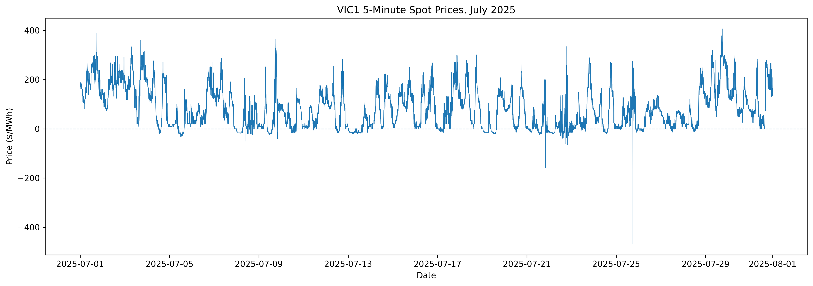
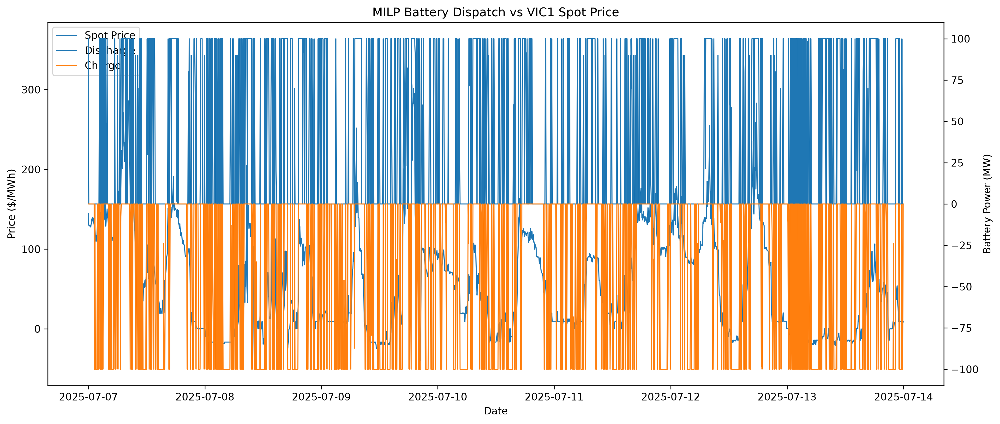
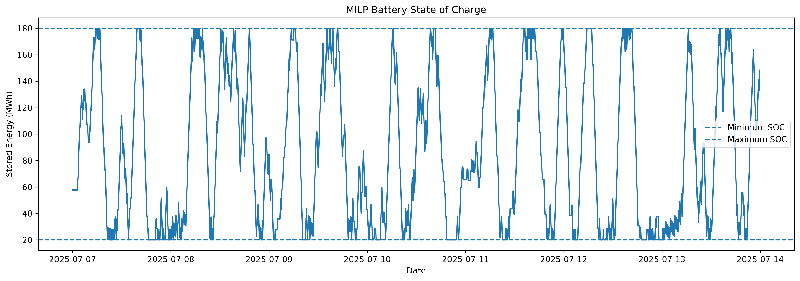
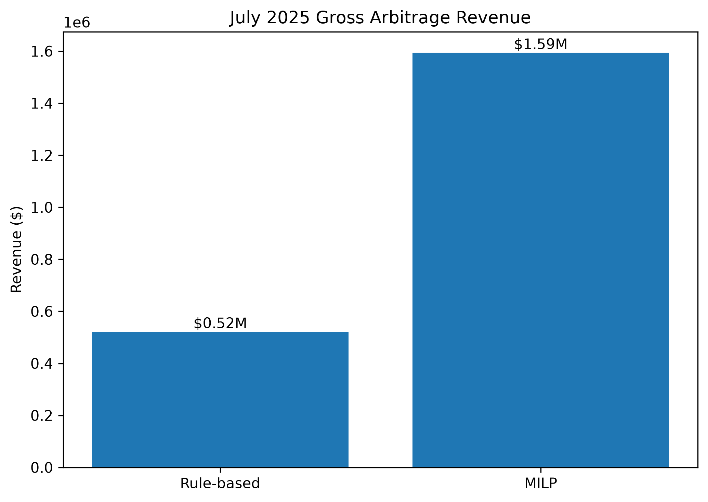
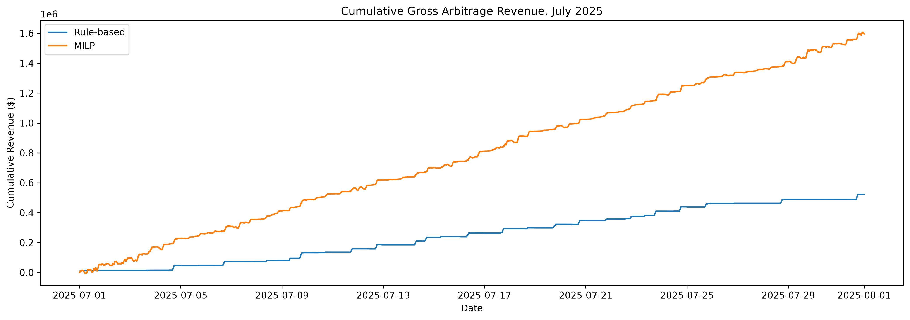

# NEM Battery Dispatch & Revenue Optimisation

A portfolio project exploring battery energy storage system (BESS) dispatch optimisation using historical 5-minute electricity spot prices from the Australian National Electricity Market (NEM).

The project compares a simple rule-based dispatch strategy with mathematical optimisation approaches, including Linear Programming (LP) and Mixed Integer Linear Programming (MILP), for a 100 MW / 200 MWh battery operating in Victoria.

## Project Objective

The objective is to maximise gross energy-arbitrage revenue by deciding when the battery should charge, discharge, or remain idle.

The workflow uses historical VIC1 spot prices from July 2025 and evaluates three strategies:

1. Rule-based benchmark
2. Perfect-foresight LP optimisation
3. Perfect-foresight MILP optimisation

The MILP is treated as the final optimisation model because it prevents simultaneous charging and discharging.

## Why This Project

Battery storage plays an important role in electricity markets by shifting energy across time.

A battery can:

- charge when electricity prices are low or negative
- store energy
- discharge when prices are high

The challenge is deciding when to act while respecting battery operating constraints such as power limits, state of charge, and round-trip efficiency.

This project demonstrates how historical market data and optimisation can be combined to quantify energy-arbitrage opportunities.

## Data

Source: AEMO MMSDM historical DISPATCHPRICE data.

Market region:

- VIC1, Victoria
- July 2025
- 5-minute dispatch intervals
- 8,928 observations

The raw AEMO MMSDM file is parsed and reduced to the main variables required for this project:

- `SETTLEMENTDATE`
- `REGIONID`
- `RRP`

### July 2025 VIC1 Price Characteristics

- Mean price: approximately $82.13/MWh
- Minimum price: approximately -$468.93/MWh
- Maximum price: approximately $406.48/MWh
- Negative-price intervals: 1,102
- Approximately 12.3% of intervals had negative prices

The presence of negative prices and substantial intraday price variation creates opportunities for battery arbitrage.

## Battery Configuration

The battery is modelled using the following assumptions:

| Parameter | Value |
|---|---:|
| Power rating | 100 MW |
| Energy capacity | 200 MWh |
| Duration | 2 hours |
| Minimum SOC | 20 MWh |
| Maximum SOC | 180 MWh |
| Initial SOC | 100 MWh |
| Round-trip efficiency | 90% |
| Dispatch interval | 5 minutes |

Charge and discharge efficiencies are represented symmetrically as:

```text
η_charge = sqrt(0.90)
η_discharge = sqrt(0.90)
```

State of charge evolves according to:

```text
SOC[t+1]
=
SOC[t]
+ charge[t] × Δt × η_charge
- discharge[t] × Δt / η_discharge
```

## Strategy 1: Rule-Based Baseline

A simple benchmark strategy is used before optimisation.

The battery:

- charges when price is below the monthly 25th percentile
- discharges when price is above the monthly 75th percentile
- remains idle otherwise

For July 2025:

```text
Charge threshold    ≈ $8.95/MWh
Discharge threshold ≈ $135.44/MWh
```

This strategy provides a simple benchmark against which optimisation can be evaluated.

## Strategy 2: Linear Programming

The LP model selects charging and discharging power for every 5-minute interval across July.

### Decision Variables

```text
charge[t]
discharge[t]
soc[t]
```

### Objective

Maximise gross energy-arbitrage revenue:

```text
Σ price[t] × (discharge[t] - charge[t]) × Δt
```

### Constraints

The model includes:

- maximum charging power
- maximum discharging power
- minimum and maximum SOC
- charge/discharge efficiency
- initial SOC
- terminal SOC equal to initial SOC

### LP Validation Issue

The LP achieved an optimal mathematical solution, but validation identified:

```text
400 intervals
```

with simultaneous charging and discharging.

This occurred because negative electricity prices can make simultaneous operation mathematically attractive when charging and discharging are represented as independent continuous variables.

This result demonstrated an important modelling limitation of the LP formulation.

## Strategy 3: Mixed Integer Linear Programming

The final model introduces a binary operating-mode variable:

```text
charge_mode[t] ∈ {0, 1}
```

with constraints:

```text
charge[t] <= POWER_MW × charge_mode[t]

discharge[t] <= POWER_MW × (1 - charge_mode[t])
```

This ensures the battery cannot charge and discharge at the same time.

The resulting model is a Mixed Integer Linear Program, MILP.

## Perfect Foresight

Both optimisation models use actual historical July prices across the complete optimisation horizon.

This means the optimiser knows future prices perfectly when making its decisions.

The MILP result should therefore be interpreted as a historical perfect-information benchmark rather than a live trading strategy.

It answers:

> If all July 2025 VIC1 prices had been known in advance, how could this battery have been dispatched to maximise gross energy-arbitrage revenue under the model assumptions?

## Results

| Strategy | Gross Revenue | Equivalent Cycles | Charge Intervals | Discharge Intervals | Simultaneous Intervals |
|---|---:|---:|---:|---:|---:|
| Rule-based | $521,874.69 | 14.3 | 391 | 358 | 0 |
| LP | $1,596,923.80 | 124.9 | 3,472 | 3,123 | 400 |
| MILP | $1,594,736.38 | 117.1 | 3,271 | 2,910 | 0 |

### Final MILP Result

The physically constrained MILP achieved:

```text
Gross July revenue: $1,594,736.38
```

compared with:

```text
Rule-based revenue: $521,874.69
```

This represents approximately:

```text
205.6% higher gross revenue
```

than the rule-based benchmark.

The MILP retained almost all of the LP revenue while eliminating simultaneous charging and discharging.

## Energy Throughput

| Strategy | Energy Charged | Energy Discharged |
|---|---:|---:|
| Rule-based | 3,102.8 MWh | 2,868.4 MWh |
| LP | 27,760.1 MWh | 24,984.1 MWh |
| MILP | 26,028.4 MWh | 23,425.6 MWh |

The optimisation models cycle the battery much more aggressively than the rule-based strategy.

This highlights the importance of considering battery degradation and cycling costs in more advanced dispatch models.

## Visualisations

### VIC1 Spot Prices



### MILP Dispatch vs Spot Price



### Battery State of Charge



### Revenue Comparison



### Cumulative Revenue



## Project Structure

```text
nem-bess-optimisation/
├── data/
│   ├── raw/
│   └── processed/
├── notebooks/
│   ├── 01_price_exploration.ipynb
│   ├── 02_baseline_dispatch.ipynb
│   ├── 03_optimisation.ipynb
│   ├── 04_performance_analysis.ipynb
│   └── 05_visualisations.ipynb
├── outputs/
│   ├── figures/
│   └── results/
├── src/
│   ├── battery.py
│   ├── baseline.py
│   ├── data_processing.py
│   └── optimisation.py
├── pyproject.toml
├── uv.lock
└── README.md
```

## Outputs

The project saves interval-level dispatch results for reproducible analysis:

```text
outputs/results/
├── baseline_dispatch.csv
├── lp_dispatch.csv
├── milp_dispatch.csv
├── summary_metrics.csv
└── performance_kpis.csv
```

## Technologies

- Python
- pandas
- NumPy
- Matplotlib
- PuLP
- HiGHS
- Jupyter
- uv

## Key Learnings

This project demonstrates:

- ingestion and processing of AEMO MMSDM electricity-market data
- analysis of 5-minute NEM spot prices
- modelling of BESS power, energy, efficiency, and SOC constraints
- construction of rule-based dispatch benchmarks
- LP formulation for energy arbitrage
- MILP formulation using binary operating-mode constraints
- identification and correction of unrealistic optimisation behaviour
- historical revenue backtesting
- battery cycling and throughput analysis
- communication of optimisation results through visualisations

## Limitations

The project intentionally uses a simplified battery and market model.

The current version does not include:

- price forecasting
- forecast uncertainty
- battery degradation cost
- cycle-dependent ageing
- FCAS revenues
- bidding strategy
- network constraints
- market fees
- outages or availability constraints
- dynamic power or efficiency curves
- operational losses beyond the assumed round-trip efficiency

Revenue should therefore be interpreted as gross historical energy-arbitrage value under the stated assumptions, not realised project profit.

## Potential Extensions

Future versions could include:

### Degradation-Aware Optimisation

Introduce a throughput or cycling cost so the optimiser trades only when expected arbitrage value exceeds battery-wear cost.

### Rolling Forecast-Based Optimisation

Replace perfect future prices with forecasts and repeatedly optimise over a rolling horizon.

```text
Historical information
        ↓
Price forecast
        ↓
Rolling MILP optimisation
        ↓
Battery dispatch
        ↓
Actual market outcome
        ↓
Realised revenue
```

This would enable comparison between:

```text
Rule-based dispatch
vs
Forecast-driven optimisation
vs
Perfect-foresight optimisation
```

### Additional NEM Revenue Streams

Extend the model to consider FCAS and potentially co-optimise energy and ancillary-service revenues.

## Summary

This project builds an end-to-end historical BESS dispatch optimisation workflow using real AEMO 5-minute NEM prices.

The final MILP demonstrates how mathematical optimisation can significantly outperform a simple rule-based arbitrage strategy while respecting battery operating constraints.

The perfect-foresight result provides a useful benchmark for understanding the theoretical value available from energy arbitrage and creates a foundation for future forecast-driven and degradation-aware battery optimisation.
